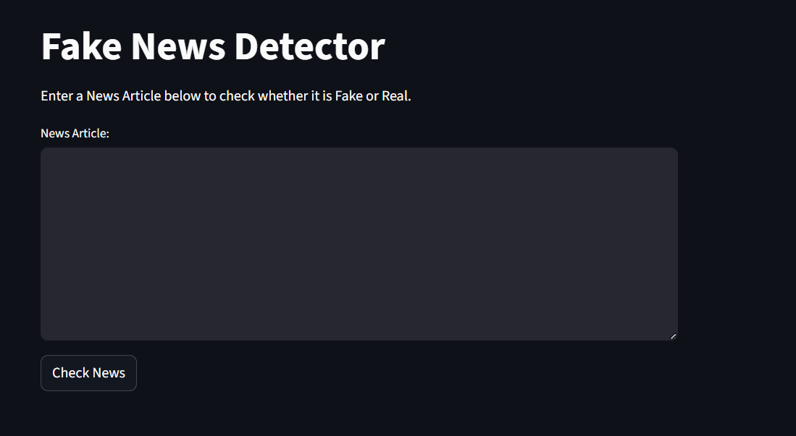
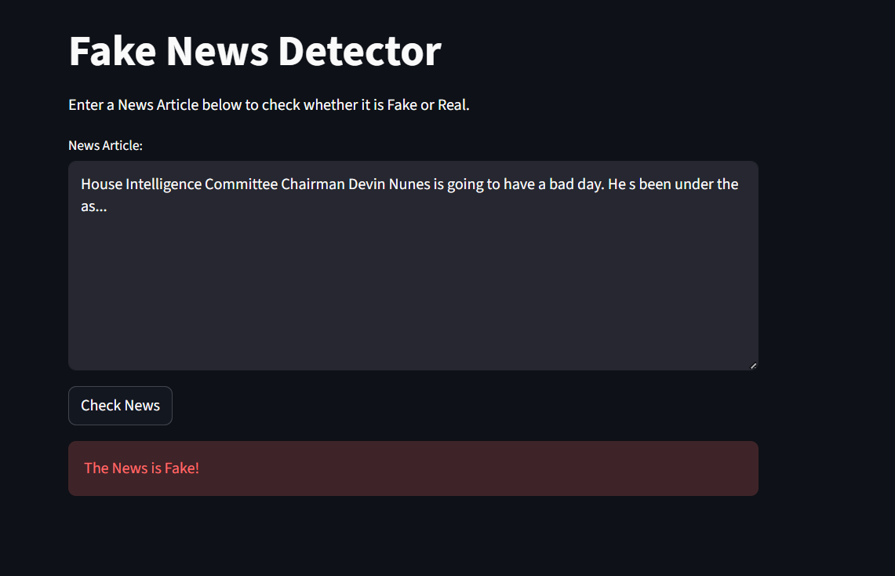
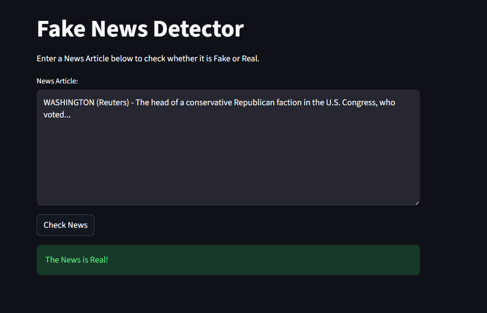

# 📰 Fake News Detection App 🧠

## 📌 Overview

In today’s digital world, misinformation spreads faster than ever. The **Fake News Detection App** is an AI-powered system that uses **Machine Learning (ML)** and **Natural Language Processing (NLP)** to determine whether a news article is **Real** or **Fake** based solely on its textual content.

Built using **Python**, **Scikit-learn**, and **Streamlit**, the application provides a clean, modern, and interactive interface. Users can paste or type a news article and instantly receive predictions, making the app useful for students, researchers, and anyone concerned about online misinformation.

---

## 🖼️ Application Interface

### Initial User Interface

  

The interface allows users to enter a news article into a text box and submit it for analysis using a single click.

---

## 🎯 Key Features

- User-friendly Streamlit interface with no technical knowledge required  
- Real-time fake news detection and classification  
- Logistic Regression model for fast and accurate binary classification  
- TF-IDF vectorization to capture word importance and context  
- Robust text preprocessing pipeline for improved prediction accuracy  
- Lightweight design suitable for cloud deployment  

---

## ⚙️ How It Works

The application follows a structured data science workflow to ensure meaningful and reliable predictions.

### Dataset

The model is trained on two curated datasets:
- **True.csv** – Verified and factual news articles  
- **Fake.csv** – Misleading or fabricated news articles  

### Text Preprocessing Pipeline

Each input article undergoes multiple preprocessing steps:
- Lowercasing to remove case sensitivity  
- Removal of punctuation and special characters  
- Stop-word removal to eliminate common but uninformative words  
- Stemming or lemmatization to reduce words to their root forms  

### Feature Extraction and Prediction

The cleaned text is transformed using **TF-IDF (Term Frequency–Inverse Document Frequency)** into numerical vectors. These vectors are passed into a **Logistic Regression** model that identifies statistical patterns associated with Real and Fake news.

---

## 🧪 Prediction Results

### Fake News Detection Result

  

When the input article contains misleading or fabricated patterns, the system clearly highlights the result as **Fake News**.

---

### Real News Detection Result

  

Articles that follow factual reporting patterns are classified as **Real News** and displayed accordingly.

---

## 🖥️ User Workflow

1. Paste a news article or headline into the input text box  
2. Click the **Check News** button  
3. View the classification result:
   - 🟢 **Real News** – Indicates factual reporting  
   - 🔴 **Fake News** – Indicates misinformation  

---

## 🛠️ Tech Stack

- **Programming Language:** Python  
- **Machine Learning Framework:** Scikit-learn  
- **Natural Language Processing:** NLTK, Scikit-learn Vectorizers  
- **Web Framework:** Streamlit  
- **Data Handling:** Pandas, NumPy  

---

## 🚀 Future Enhancements

- Integration of deep learning models such as LSTM, BERT, or Transformers  
- Addition of confidence scores for predictions  
- Support for news URL-based detection  
- Multi-language fake news detection  
- Improved UI with analytics and explainable AI features  

---

## 📄 License

This project is licensed under the **MIT License**. You are free to use, modify, and distribute this project.

---

## ⭐ Acknowledgements

Special thanks to the Scikit-learn community, the Streamlit team, and the open-source NLP contributors who made this project possible.

If you find this project useful, consider giving it a ⭐ on GitHub.
